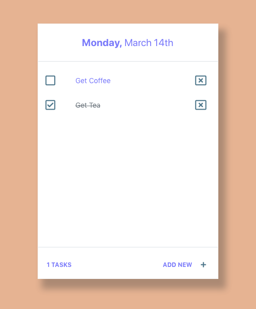

# Todo List



## Description

This simple React Todo List.

## How To Use

**Note**: System should have the latest version of [Node](https://nodejs.org/en/), [git](https://git-scm.com/downloads), and npm

1. Download or Clone the repo using terminal

```bash
$ git clone https://github.com/cye158/tdl.git
```

2. `cd` into project folder `tdl`

```bash
$ cd tdl
```

3. Install the dependencies needed

```bash
$ npm install
```

4. Launch application

```bash
$ npm start
```
